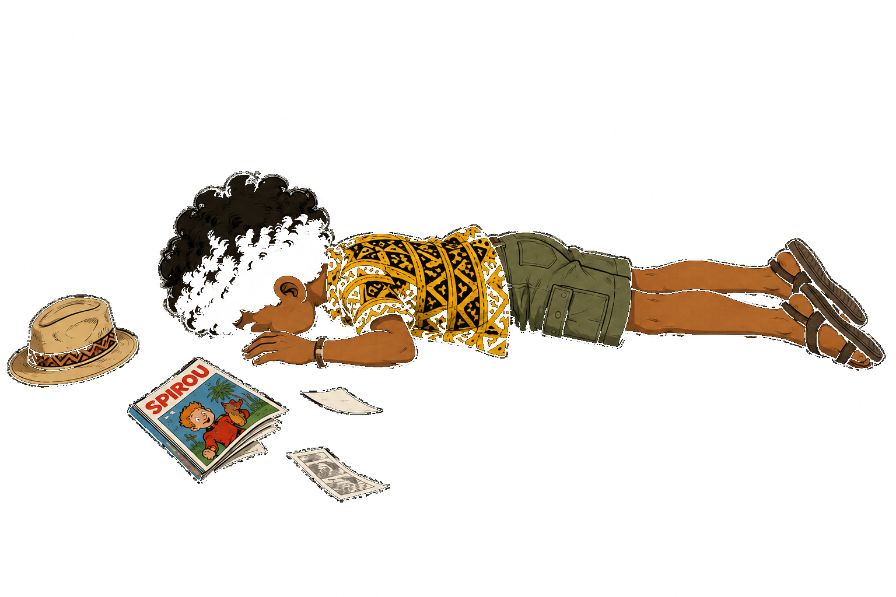

# CV John Waïa

Mon CV en ligne interactif, développeur Full Stack Junior — construit avec React.
Le site se présente comme un enchaînement de sections plein écran, chacune dédiée à une facette du profil : présentation, formation, expériences, compétences, soft skills, centres d'intérêt, projets, statistiques de visite et contact. Un "mode recruteur" permet aussi d'afficher un résumé condensé du CV en 30 secondes.

🔗 **lien vers le CV :** [johnwaia.github.io/cv_john_waia](https://johnwaia.github.io/cv_john_waia)


## Sommaire


- [Aperçu](#aperçu)
- [Fonctionnalités](#fonctionnalités)
- [Stack technique](#stack-technique)
- [Structure du projet](#structure-du-projet)
- [Démarrage rapide](#démarrage-rapide)
- [Scripts disponibles](#scripts-disponibles)
- [Configuration](#configuration)
- [Déploiement](#déploiement)
- [Détails d'architecture](#détails-darchitecture)
- [Licence](#licence)
- [Contact](#contact)

## Aperçu

Mon CV s'organise en une page unique (`/`) découpée en sections `100vh` qui s'enchaînent dans un défilement classique et continu. Une bulle de bienvenue s'affiche à l'ouverture (avec un message et un GIF différents selon l'heure de la journée), un switch "mode nuit" permet de basculer le thème (et la vidéo de fond) de la section d'accueil, un switch "mode recruteur" affiche un résumé condensé du CV, un bouton "retour en haut" apparaît après un certain scroll, et **Talo**, un petit personnage mascotte, dégringole le long de l'écran au fil du scroll à partir de la section Formation (et peut être attrapé et déplacé à la souris pendant sa chute).

| Section | Contenu |
|---|---|
| 🏠 Accueil | Vidéo de fond (lagon, jour/nuit), carte de présentation translucide (effet verre dépoli), photo, présentation animée façon terminal de code, indicateur de scroll, switch mode nuit, bouton de téléchargement du CV en PDF |
| 🎓 Formation | Parcours scolaire (Licence Informatique, BTS Bâtiment, Bac STI2D…) par onglets |
| 💼 Expériences | Historique professionnel filtrable par catégorie (Informatique, Restauration, Intérim, Bénévolat…), cartes retournables avec logo entreprise |
| 🛠️ Compétences | Compétences techniques par domaine (Informatique / Bâtiment / Bureautique), classées par catégories (langages, frameworks, outils, déploiement, tests, méthodes agiles, réseaux…) |
| 🌟 Soft Skills | Grille de qualités humaines illustrées |
| 🎯 Centres d'intérêt | Loisirs et passions |
| 🚀 Projets | Portfolio de projets (pédagogiques, personnels, autres) avec captures d'écran et onglets détaillés |
| 📊 Statistiques de visite | Compteur de visiteurs en temps réel via une API dédiée |
| 📬 Contact | Formulaire de contact (Formspree) + réseaux sociaux |
| ⚡ Mode recruteur | Résumé condensé du CV (30s) avec la même vidéo de fond (jour/nuit) que l'accueil : formation, expérience clé, compétences clés, soft skills, contact — avec un bouton "Voir plus" par bloc pour rejoindre directement la section complète correspondante, et un bouton de téléchargement du CV en PDF |

## Fonctionnalités

- **Sections plein écran en défilement continu** : chaque section (`.cv-section`) occupe au moins un écran et s'enchaîne normalement dans le flux de la page (pas d'empilement `sticky`, pour un scroll fiable au trackpad et au tactile).
- **Talo, la mascotte qui chute au scroll** : fixé sur le bord gauche de l'écran, ce petit personnage reste debout tant qu'on n'a pas atteint la section Formation, puis tombe (et tournoie) au fur et à mesure du scroll jusqu'à la section Contact. Pendant sa chute, on peut le saisir (glisser-déposer à la souris) et le déplacer librement dans la fenêtre. Respecte `prefers-reduced-motion`.
- **Mode nuit** : switch (interrupteur à glissière) sur la section d'accueil qui change la vidéo de fond (jour/nuit) et applique un thème sombre à l'ensemble du site.
- **Mode recruteur (résumé 30s)** : switch en haut de page qui affiche un résumé condensé du CV (`QuickSummary`) — formation, expérience clé, compétences clés, soft skills et contacts — avec un bouton "Voir plus" sur chaque bloc pour revenir au CV complet directement sur la section correspondante. Reprend la même vidéo de fond (jour/nuit) que la section d'accueil.
- **Téléchargement du CV en PDF** : bouton présent sur la section d'accueil et dans le mode recruteur, qui télécharge directement `src/assets/CV_John WAIA_Emploi.pdf`.
- **Message d'accueil dynamique** : la bulle de bienvenue affiche un texte et un GIF différents selon l'heure de la journée (matin, après-midi, soir).
- **Animations au scroll** : apparition progressive des éléments via `IntersectionObserver` (`ScrollReveal`), effet "distribution de cartes" sur les onglets.
- **Bio façon terminal** : la présentation est "tapée" caractère par caractère dans un faux terminal (`whoami`, `cat bio.txt`, `cat formation.txt`).
- **Vidéo de fond** en boucle sur la section d'accueil, contenu regroupé dans une carte translucide (effet verre dépoli) pour rester lisible tout en laissant deviner la vidéo derrière.
- **Onglets réutilisables** (`ProjetTabs`, formation, compétences, expériences) avec effet de distribution de cartes à chaque changement d'onglet.
- **Cartes d'expérience retournables** (recto : poste/dates, verso : détails des missions).
- **Filtrage par catégorie** des expériences professionnelles.
- **Compteur de visiteurs** avec appel à une API externe (rang du visiteur, total, session persistée en `sessionStorage`).
- **Formulaire de contact fonctionnel** via [Formspree](https://formspree.io/).
- **Responsive** : mise en page adaptée mobile/tablette/desktop (grilles, colonnes CSS, tailles de police).
- **Accessibilité** : respect de `prefers-reduced-motion` (désactivation des animations), attributs `aria-*` sur les éléments décoratifs.

## Stack technique

- **[React 18](https://react.dev/)** (bootstrapé avec [Create React App](https://github.com/facebook/create-react-app) / `react-scripts`)
- **CSS** : feuilles de styles dédiées par composant (pas de framework CSS imposé ; Bootstrap et MDB UI Kit sont installés mais l'essentiel du style est du CSS/JS custom)
- **[Formspree](https://formspree.io/)** (`@formspree/react`) pour le formulaire de contact
- **[gh-pages](https://www.npmjs.com/package/gh-pages)** pour le déploiement sur GitHub Pages
- **Testing Library** (`@testing-library/*`) pour les tests

## Structure du projet

```
cv_john_waia/
├── public/                     # index.html, favicon, manifest, logo
├── src/
│   ├── App.js / App.css        # Orchestration des sections, mode nuit
│   ├── index.js                # Point d'entrée React
│   ├── WelcomePopup.js         # Bulle de bienvenue à l'ouverture
│   ├── cardTabs.css            # Styles partagés des onglets "façon carte"
│   ├── description/
│   │   ├── Description.js      # Présentation (photo, bio terminal, indicateur scroll)
│   │   └── description.css
│   ├── scrollreveal/
│   │   ├── ScrollReveal.js     # Composant générique d'animation au scroll
│   │   └── ScrollReveal.css
│   ├── fallingCharacter/
│   │   ├── FallingCharacter.js # Talo, la mascotte qui chute au scroll
│   │   └── FallingCharacter.css
│   ├── contact/
│   │   ├── Contact.js
│   │   └── contact.css
│   ├── formations/
│   │   └── formation.js        # Parcours scolaire
│   ├── experiences/
│   │   ├── experiences.js      # Expériences professionnelles (filtrage + cartes)
│   │   └── experience.css
│   ├── competences/
│   │   ├── Competences.js      # Compétences techniques par catégorie
│   │   └── competences.css
│   ├── softSkill/
│   │   ├── softskills.js       # Grille de soft skills
│   │   └── softskillList.js    # Données des soft skills
│   ├── centreInteret/
│   │   └── centreInteret.js    # Centres d'intérêt
│   ├── projet/
│   │   ├── project.js          # Portfolio de projets
│   │   └── projetTabs.js       # Onglets réutilisables pour le détail d'un projet
│   ├── Stats/
│   │   └── stats.js            # Compteur de visiteurs
│   ├── quickSummary/
│   │   ├── QuickSummary.js     # Mode recruteur : résumé condensé du CV (30s)
│   │   └── quickSummary.css
│   └── assets/                 # Images/logos utilisés dans le CV + CV_John WAIA_Emploi.pdf (téléchargement)
├── package.json
└── README.md
```

## Démarrage rapide

### Prérequis

- [Node.js](https://nodejs.org/) 18+ recommandé
- npm (fourni avec Node.js)

### Installation

```bash
git clone https://github.com/johnwaia/cv_john_waia.git
cd cv_john_waia
npm install
```

### Lancer en développement

```bash
npm start
```

Ouvre [http://localhost:3000](http://localhost:3000) — l'application se recharge automatiquement à chaque modification.

## Scripts disponibles

| Commande | Description |
|---|---|
| `npm start` | Lance le serveur de développement (hot reload) |
| `npm test` | Lance les tests en mode watch interactif |
| `npm run build` | Génère le build de production optimisé dans `build/` |
| `npm run deploy` | Build puis publie le contenu de `build/` sur GitHub Pages (via `gh-pages`) |
| `npm run eject` | Éjecte la configuration Create React App (irréversible) |

## Configuration

Le projet appelle deux services externes qu'il faut reconfigurer si vous forkez ce dépôt :

- **Formulaire de contact** (`src/contact/Contact.js`) : utilise Formspree avec l'ID de formulaire `xgvyyabv`. Remplacez-le par votre propre ID Formspree ([créer un formulaire](https://formspree.io/)).
- **Compteur de visiteurs** (`src/Stats/stats.js`) : appelle `https://visitor-notifier.onrender.com/visit`, un petit backend Node.js/Render dédié qui enregistre les sessions et renvoie le rang du visiteur ainsi que le total. Remplacez `API_URL` par votre propre service si besoin.

Aucune variable d'environnement n'est requise pour lancer le projet en local (`npm start` fonctionne tel quel).

## Déploiement

Le site est déployé sur **GitHub Pages** à l'adresse définie par le champ `homepage` de `package.json` :

```bash
npm run deploy
```

Cette commande exécute `npm run build` (via `predeploy`) puis publie le contenu du dossier `build/` sur la branche `gh-pages` du dépôt grâce au paquet [`gh-pages`](https://www.npmjs.com/package/gh-pages).

## Détails d'architecture

- **Sections en flux normal** : chaque section (`.cv-section`) occupe au moins `100vh`/`100dvh` et s'enchaîne dans le flux de page classique. Un empilement `position: sticky` ("effet feuilles") a été essayé puis retiré : combiné à un scroll interne par section, il rendait le défilement continu (trackpad, tactile, certaines souris) imprévisible, avec des sauts vers la section suivante en plein milieu du contenu.
- **Mode nuit** : `darkMode` (état dans `App.js`) bascule une classe `dark-mode` sur le conteneur racine et `dark-mode-body` sur `<body>`, change la vidéo de fond de la section d'accueil (`HERO_VIDEO_DAY` / `HERO_VIDEO_NIGHT`) et adapte les styles (`App.css`) sur l'ensemble du site.
- **Compétences en colonnes** : la section Compétences utilise une mise en page CSS multi-colonnes (`columns`) pour que toutes les catégories tiennent sur un seul écran sans défilement interne.
- **Vidéo de fond** : lecture en boucle, coupée (`muted`) et `playsInline` pour l'autoplay cross-navigateur ; le contenu textuel est regroupé dans une carte translucide (`backdrop-filter: blur`) pour rester lisible par-dessus la vidéo.
- **Talo** : position calculée à chaque scroll (`FallingCharacter.js`) à partir de la progression entre le haut de la section `#formation` et le bas de la page ; le personnage est masqué avant ce point, affiché debout à l'arrivée sur Formation, puis bascule (crossfade) vers une illustration de chute avec un léger tournoiement au fil du scroll. Un glisser-déposer à la souris permet de le déplacer manuellement pendant la chute, sans interférer avec le pilotage par le scroll une fois relâché.
- **Mode recruteur** : `quickMode` (état dans `App.js`) masque le `<main>` (sections complètes conservées dans le DOM, `display: none`) et affiche `QuickSummary`. Chaque bouton "Voir plus" appelle `onSwitchToFull(sectionId)`, qui repasse en mode complet puis, une fois le DOM réaffiché (via `requestAnimationFrame`), scrolle en douceur jusqu'à la section (`id`) correspondante. `darkMode` est aussi transmis à `QuickSummary` pour y rejouer la même vidéo de fond jour/nuit que l'accueil.
- **Téléchargement du CV** : `src/assets/CV_John WAIA_Emploi.pdf` est importé directement dans `App.js` et `QuickSummary.js` ; Create React App (webpack) l'expose comme une URL statique, consommée par un simple `<a href={cvPdf} download>`.

## Licence

Projet personnel — tous droits réservés. Le code peut être consulté à titre d'exemple, mais le contenu (textes, photos, CV) est spécifique à MOI.

## Contact

- **GitHub :** [@johnwaia](https://github.com/johnwaia)
- **LinkedIn :** [john-waïa](https://www.linkedin.com/in/john-wa%C3%AFa-314251218/)



